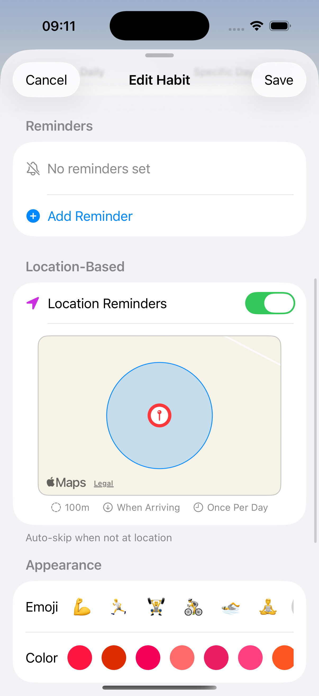
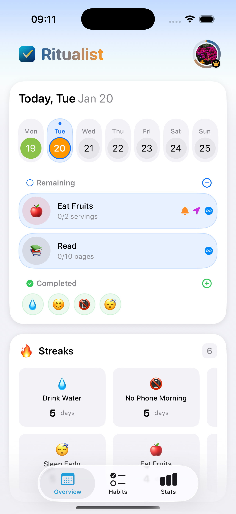
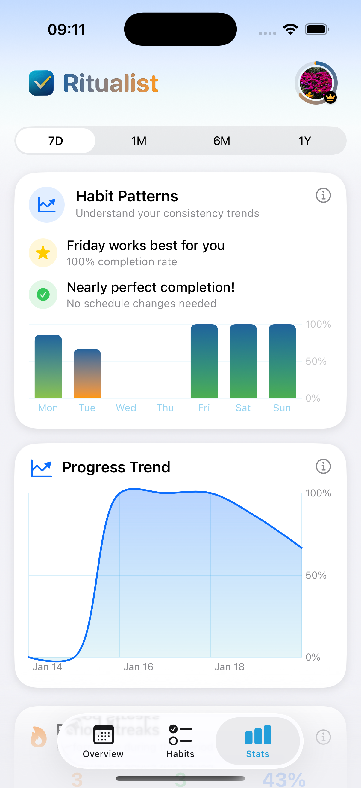

# Ritualist Website

Modern landing page for [Ritualist](https://github.com/vladblajovan/Ritualist) - an iOS habit tracker that knows you.

## Overview

This is the official marketing website for Ritualist, a modern iOS habit tracking app built with SwiftUI. The website showcases the app's key features including location-based reminders, AI personality insights, beautiful analytics, and more.

## Features Showcase

The website includes 6 feature sections with real iOS app screenshots:

### 📍 Smart Location Triggers
Never miss a habit again with intelligent geofencing that reminds you when you arrive at specific locations.

### 🧠 Know Yourself Better
ML-powered personality analysis that generates insights about your Big Five personality traits based on your habits.

### 📊 Beautiful Analytics
Track your progress with stunning visualizations including streaks, completion rates, and weekly trends.

### 🎨 Make It Yours
Personalize every detail with custom colors, emojis, and categories for each habit.

### ☁️ Seamless Everywhere
iCloud sync keeps your data up-to-date across all your Apple devices in real-time.

### 🔒 Your Privacy, Protected
Everything runs on-device with zero data collection. Your habits, your data, your control.

## Pricing Tiers

The website accurately reflects the app's pricing:
- **Free:** Up to 5 habits with basic features
- **Weekly:** $2.99/week
- **Monthly:** $9.99/month
- **Annual:** $49.99/year (Most Popular)

## Related Projects

- [Ritualist iOS App](https://github.com/vladblajovan/Ritualist) - The main iOS application

## License

This project is part of the Ritualist ecosystem. See the main [Ritualist repository](https://github.com/vladblajovan/Ritualist) for license information.

## Author

**Vlad Blajovan**
- GitHub: [@vladblajovan](https://github.com/vladblajovan)
- Twitter: [@vladblajovan](https://twitter.com/vladblajovan)

---

Built with ❤️ using Next.js and Tailwind CSS
